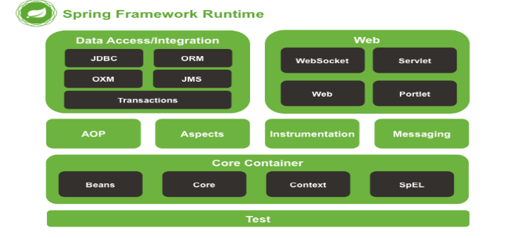

### 业务Bean

#### 1 ...实例
#### 2 ...属性设置
#### 3 BeanNameAware
#### 4 BeanFactoryAware
#### 5 ApplicationContextAware
#### 7 InitializingBean
#### 8 init-method
#### 10 BeanPostProcessor
#### 11 destroy-method

### 组件Bean

#### 6 BeanPostProcessor.postProcessBeforeInitialization
#### 9 BeanPostProcessor.postProcessAfterInitialization

